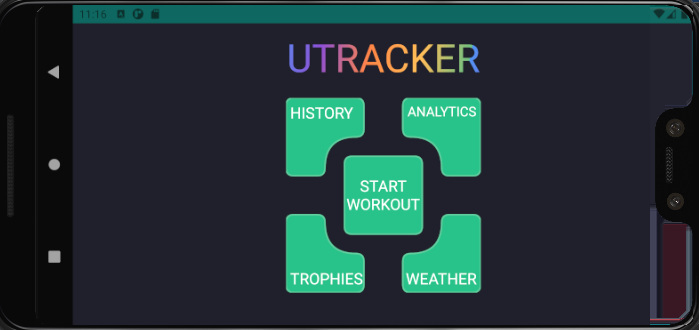

## **UTracker - Android Jogging Application**

### Introduction
This README summarizes the running tracker application that was
implemented for Mobile Device Programming module (COMP3059) at UNNC.

### Components

The core functionality of the application consists of four main Android
components, most of which are focused on location updates and user data
control:

-   Activity

-   Service

-   Content Provider

-   Broadcast Receiver

The application presents itself as a running tracker application, where
the user is able to start a workout (running, walking, mixed), set goals
and view the results. Additionally outside libraries were used to
enhance the performance of the application and simplify the readability
of the code for a possible next reader (Section 5).

Figure 1 represents a UML class diagram of the project. The diagram was
auto-generated by Visual Paradigm software. If some
part of the diagram is not clear to you, please refer to the methods in
the according code segments; all project code is well-documented.

There are six activities in the application, where `MainActivity` is a
launcher class. The main class works as a menu to navigate around the
application. Five additional classes work as features of the
application: `Weather.class` shows the current weather with additional
information, `History.class` presents the past workout sessions, etc.

The main functionality behind the application was to build the workout
class which would use a location service and receive the location
updates by using Broadcast Receiver. Additionally, Content Provider
component performs all CRUD operations in different classes.

All components are interacting with each other, but split into separate
packages to simplify the readability of the code and alleviate the
confusion for a possible next person to work on the project.

### Location Service

Location package only consists of one class - `LocationService.class`.
Sheriff permissions library was used as a third-party tool to
ask the users for location permissions in an easier way.

Location service can be launched from two classes: `StartWorkout.class`
and `Weather.class`. Workout class is using broadcast receiver to update
the information during the workout every three seconds. Location service
uses Intent to pass the data (location, speed, distance). Additionally,
workout class uses Google Maps to display the current location in
real-time. Weather class uses only the passed location to retrieve the
weather information at the specified location. Berko's OpenWeatherMap
Android library was used to simplify the process of
weather retrieval.

It is worth noting that location service uses GPS Provider and does not
work all the time to save the battery power. The service is only started
when the workout or weather classes are launched. When the user finishes
with any of those classes, the service is deactivated (`stopService()`),
and the broadcast receiver gets unregistered.

### Content Provider

Content provider is responsible for creating a database and tables for
the user on the first launch and performing CRUD operations on the
tables. Database package contains three classes: `DBHelper`,
`WorkoutProvider` and `WorkoutProviderContract`. DBHelper only
instantiated once on the first run of the application after the
installation and it creates the database with one table. Table
1 describes the contents of the history
table which provides the information about user's workout.

:::
  Name           Type     Description
  -------------- -------- -----------------------------------------------------------------
  date           long     Start time of the workout (epoch time)
  duration       long     Duration of the workout
  avgSpeed       double   Average speed of the user during the workout
  activityType   String   Running, Walking or Mixed activity types.
  distance       double   The distance in meters from the start to the end of the workout
  note           String   Additional note from the user about the workout
  goal           int      A distance in meters that is set as a goal for the workout

  : Database Table "History"
:::

WorkoutProviderContract works as a helper class for every other classes
which need to use the database because all the variables in this class
are final and directly linked to the table.

### Features & Challenges

This section describes the features of the application in more details,
specifically the design and the UI choices in the activities. Some of
the challenges were met during the implementation of several features,
all of which described below.

#### MainActivity.class

The launchers class was build using Rich Path library. Rich
path allows to create views and animations for XML paths, from which I
got an idea to build the menu in form of a puzzle. The buttons that you
see on Figure 2 are custom XML vectors which were drawn by
hand. Basic math, geometry and knowledge of different path techniques were used to create the main menu of the application.

However, path elements are not allowed to include text, thus I had to
manually place the names of the classes on the UI view of the launcher
class. Since the application was tested on emulated device (1080 x 1920
420dpi) running Android API version 29 (Android 10.0), everything shows
correct (Figure [2](#fig:main_menu)). However, other devices with larger or
smaller screens need some adjustments (Figures 3 & 4).

#### Weather.class

As you can see on the Figure 5, the Weather class displays the weather
forecast with additional information according to current location. If
the emulator's location changes, the weather class will be updated as
intended. However, it was noticed that the time for sunset and sunrise
is not valid, according to values of the city, but to the current time.
For example, if you are located in Russia and change your location to
somewhere in the US, sunset and sunrise time will display correctly, but
in the format of the local time.

#### History.class

History class uses CardView from Material Design and
RecyclerView with corresponding adapter to display the past
workouts. `CardItem` is a supporter class for the history class to
easily interact with the data. Additionally, the user can annotate their
workouts by adding a note. This is performed in a separate dialog when
the user pushes "View More" button on the workout card of their choice.
After the note is changed, the database and adapters are updated. No
challenges were encountered with the classes.

#### Analytics.class & Goals.class

Analytics shows the user's data about their workouts divided by all
time, current month, and current week. Calendar package handles the
calculations for the database query selections.

Goals class was implemented with an idea of adding fitness gamification
to the application to motivate the users. Achievements
encourage the users to participate more and be more active during their
workouts. Currently there are 12
possible trophies to receive and the user can tap on them to see the
requirements on how to achieve them.

#### StartWorkout.class & Location Service

StartWorkout class is one of the largest classes in the application
which is responsible for tracking the user's location and saving it in
the database using Content Provider. The user can choose the type of the
workout they want to perform, set the goal, and leave a note for the
workout session.

Some of the challenges were considered when used GPS Provider. As the
service runs only in the foreground of the application and stops if the
user closes it (background location is not implemented), it poses a
question whether the collected data is valid. For example, a user can
run laps around UNNC track and launch the process at the start, then
close the application. Assuming one lap is 1000 meters and the user has
run 5 laps, the application would show the distance around 0--1000
meters depending on the end point of the user. GPS Provider in the
application does not update the location in the background (as it is not
implemented on a background thread), thus the distance that the user has
run could be invalid in the end. The solution for this is to use the
accelerometer sensor and track the steps, later converting it to meter
distance. However, due to the lack of the physical device with the
accelerometer (emulators are incapable or tracking that type of data),
this solution was not implemented.

#### Overall UI

Overall, the UI is responsive and follows the Android guides on the UI
design. Considering that ConstraintLayout was used in almost
every activity, the separate `-land`, `-xlarge` and `-small` layouts
were not added to the application. Workout and History class were
constrained to only portrait mode due to the problems with pop up
dialogues and saved instances states.

All text strings are located in `strings.xml`, and only log texts have
hard-coded strings, as they do not need to be included in the locale
files of the application.

Drawables for the application classes were taken from Flaticon, icons8 and Material Design websites. All
icons are licensed as free to be used with the accreditation to the
author or the company.

It is worth noting that the application was also tested on a real
device, but due to unknown reasons, neither Google Map for workout class
or weather details were loaded. Internet connection was stable and all
permissions were given. My assumption was that the physical device needs
a separate sets of API keys, but the tests with newly created keys did
not solve the problem.

### Summary & Future Work

Some of the future considerations were to include the location updates
running on a background thread. However, implementing that would drain
the battery faster for the user and therefore might need another
solution.

Updating the database and including separate tables for achievements
would be another addition to the project.

Using accelerometer and other health sensors is another future
consideration of the project to improve its functionality.

All in all, this project presented a running tracker application which
allows the user to record, save, and annotate their data. Additionally,
the user has weather forecast information and gamification features,
such as achievements.
